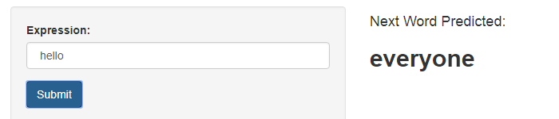

```{r setup, include=FALSE}
knitr::opts_chunk$set(echo = FALSE)
```

## About Word Predictor

Around the world, people are spending an increasing amount of time on their mobile devices. But typing on mobile devices can be a serious pain. This app pretends to help a smart keyboard to makes it easier for people to type on their mobile devices. 

To make the app, the job was to understand and build a predictive text model with: *analysis of text data and natural language processing*.

This is the Capstone Project in *Data Science Specialization* in **Coursera**, develop by **The Johns Hopkins University** and **Swiftkey** like the corporate Partner.  


## Description of the algorithm 

**Data Preparation**
<br> The data used in this project was given by *SwiftKey* company from blogs, news and twitter. The Fist step was clean the data removing all unimportant words and expessions. After, take a sample to build the model (3% in this case).

**The model**
<br> Build a ***Text Mining Model***, based in the N-gram technique. Calculating the *'Next most Probability Word'* over of frequency of two, three and four combinatios of words in the sample.  

**Performance**<br>- The data preparation for this model takes more than one hour. 
<br>- The sampling reduce 2.5 Millions of lines to  +100k.
<br>- The time to find the 'next word' is 0.5 seg in average.


## Word Predictor (Shinny application)
- The app is available in: <https://franmarq.shinyapps.io/nextwordpredictor/></br>
<br>**Instructions**
This app was built to better results in English languaje and when you use three or less words.</br>
<br>**Follow the next steps:**
<br>1. Write some words in the 'Expression:' box
<br>2. Press 'Submit' button to obtain the result
<br>3. The 'next predicted word' will appear on the right side panel



## Documentation

- The app documentation is available in: <https://github.com/franmarq/DS-CapstoneProject></br>


